# 并行计算第一次作业实验报告

陈新	计研三一	2022210877

## 实验环境

由于课程提供的编译环境过于老旧，无法编译第三方命令行解析库 `cxxopts` ，故选择使用本机环境进行实验。

配置为：i9-9900KF (8 核 16 线程，基准频率 3.6 GHz), 16 GB$\times$2 (3200 MHz), Windows11

## 实验要求

编写一个集群集合通信带宽测试程序，测试N个节点的集合通信带宽。

### 基本功能：

1. 设计读取配置文件或者命令行参数，允许选择不同的集合通信方案：如bcast/gather/reduce/allreduce/scan/alltoall等；

2. 设计配置文件或者命令行参数，允许选择多个方案，指定发送/接收数据包大小；

3. 通过屏幕打印输出带宽测试结果；

 

### 高级功能：

4. 设计配置文件或者命令行参数，允许选择对bcast/gather/reduce指定多个不同的root节点（直到指定N个节点）；

5. 可通过命令行参数或配置文件指定测试节点集N的任意子集； 在子集内也允许 4 的运行方式

 

## 实验结果

实现见文件 `main.cpp` ，支持命令行指定参数

- `-m/--mode` 指定方法 (bcast/gather/reduce/allreduce/scan/alltoall)，默认为 bcast
- `-s/--size` 指定发送/接收数据包大小，默认为 4096 B
- `-r/--repeat` 指定重复次数，默认为 1000 次
- `--root` 指定 bcast/gather/reduce 下的根节点，个数可以是 1~N ，形式为以逗号隔开的字符串
- `--valid` 指定测试节点集的子集，形式为以逗号隔开的字符串

### bcast

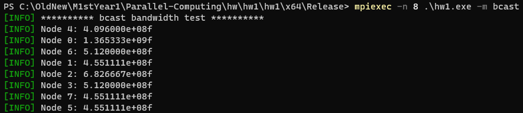

### gather

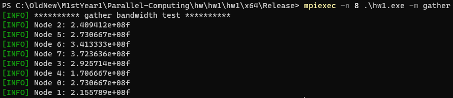

### reduce

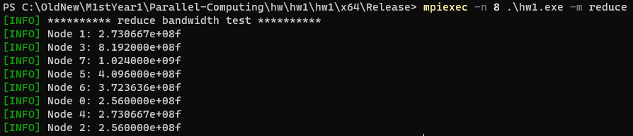

### scan

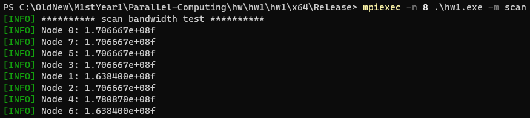

### allreduce

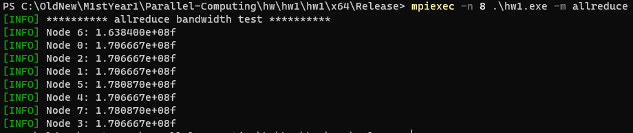

### alltoall

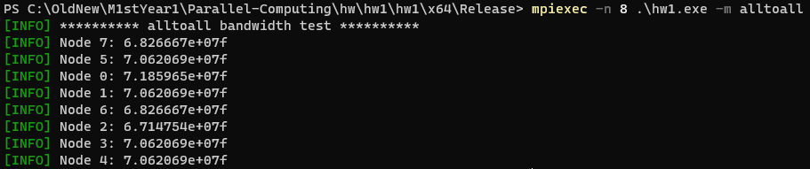

### 指定数据包大小

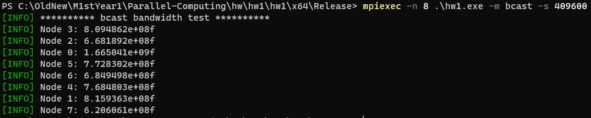

### 指定 root 节点

可以保存节点的 `is_root` 信息

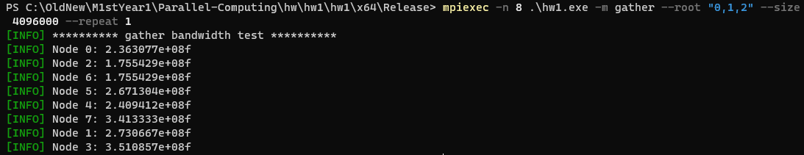

### 指定测试节点子集，并与 root 一起使用

可以使用 `MPI_Comm_split` 进行分组，同一子集的分在一组

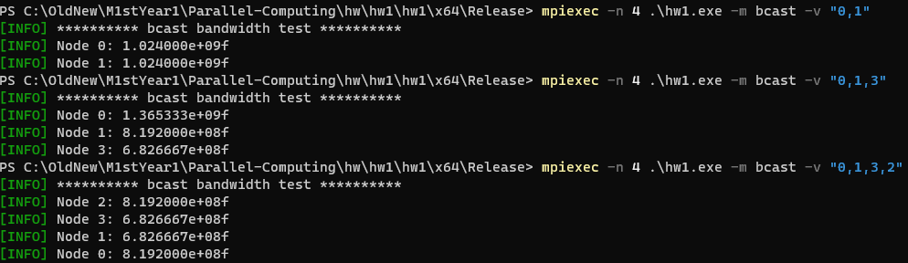

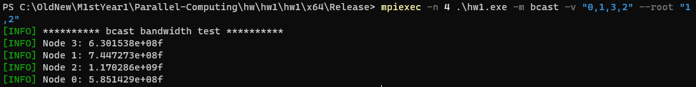

### 文件指定多 order

> -m bcast -v "0,1,3,2" --root "1,0"
> -m bcast -v "0,1,2" --root "1"

最简单的实现方法即为将命令行参数分行存到文件里，使用时仅需每行单独 `parse` 后更新参数跑程序即可

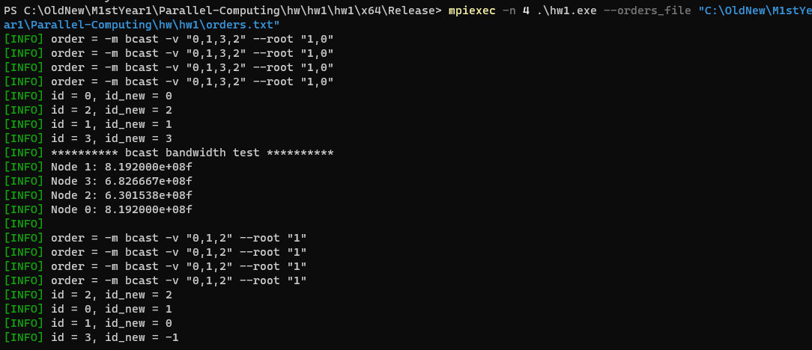