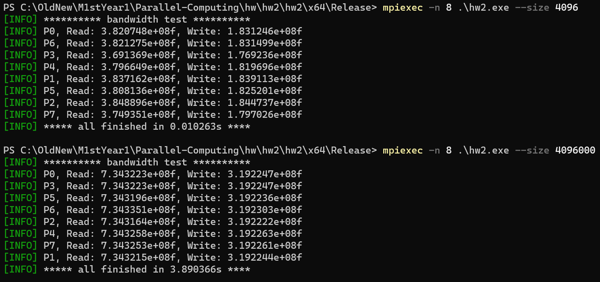
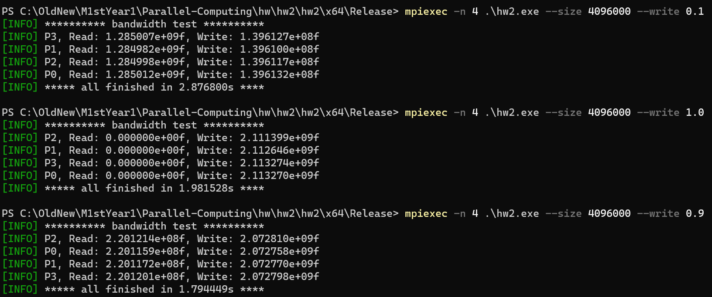
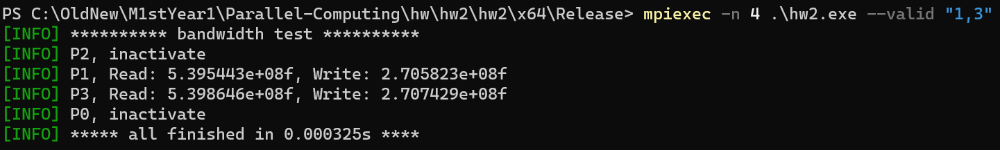
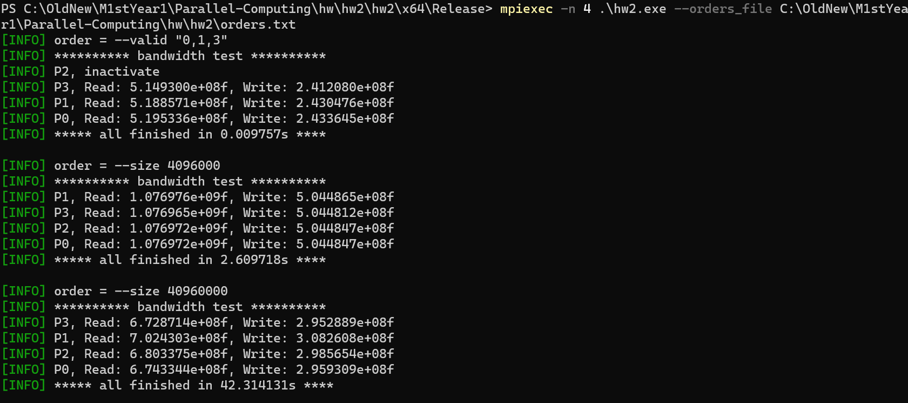

# 并行计算第二次作业实验报告

陈新	计研三一	2022210877

## 实验环境

由于课程提供的编译环境过于老旧，无法编译第三方命令行解析库 `cxxopts` ，故选择使用本机环境进行实验。

配置为：i9-9900KF (8 核 16 线程，基准频率 3.6 GHz), 16 GB$\times$2 (3200 MHz), Windows11

## 实验要求

编写一个MPIIO程序，测试不同节点到文件系统的读写带宽，聚合读写带宽。

1. 允许指定并发读写各占多大比例，可一次指定多个方案；
2. 允许指定读写的数据块大小，可一次指定多个方案；
3. 允许指定并行启动读写的节点个数（节点集）；
4. 允许指定单节点启动的读/写进程数；

 

## 实验结果

实现见文件 `main.cpp` ，支持命令行指定参数

- `--rankfile` 指定单节点启动的读/写线程数
- `-s/--size` 指定发送/接收数据包大小，默认为 4096 B
- `-w/--write` 指定写指令占总读写指令的比例，$[0.0, 1.0]$，默认为 0.3
- `-r/--repeat` 指定重复次数，默认为 1000 次
- `--valid` 指定测试节点集的子集，形式为以逗号隔开的字符串
- `--orders_file` 指定方案文件（可以指定多种配置方案）

### 指定数据包大小

### 指定读写比例

### 指定测试节点子集

可以使用 `MPI_Comm_split` 进行分组，同一子集的分在一组

### 文件指定多 order

> --valid "0,1,3"
> --size 4096000
> --size 40960000

最简单的实现方法即为将命令行参数分行存到文件里，使用时仅需每行单独 `parse` 后更新参数跑程序即可，见 `orders.txt`

