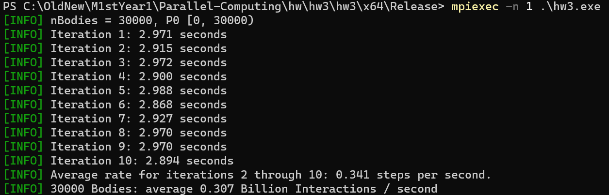
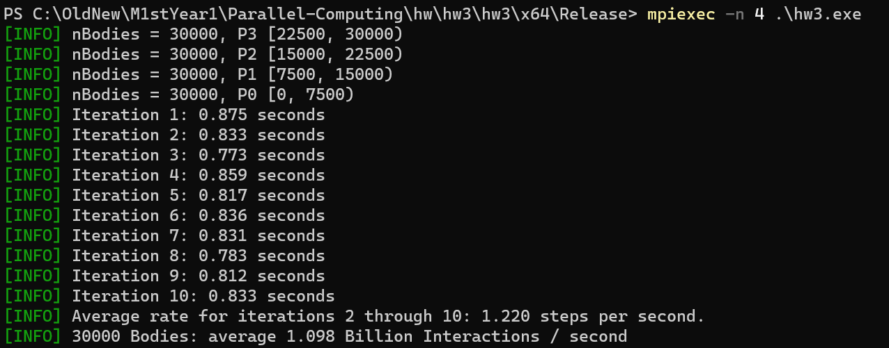

# 并行计算第三次作业实验报告

陈新	计研三一	2022210877

## 实验环境

由于课程提供的编译环境过于老旧，无法编译第三方命令行解析库 `cxxopts` ，故选择使用本机环境进行实验。

配置为：i9-9900KF (8 核 16 线程，基准频率 3.6 GHz), 16 GB$\times$2 (3200 MHz), Windows11

## 实验要求

将流体模拟算法由串行改为并行

 

## 实验结果

实现见文件 `parallel.cpp` 

算法流程分为两个部分

1. 计算粒子之间的相互作用力，即得到 `dt` 期间的加速度，可以得到 `dt` 时间段之后的速度 `v`
2. 根据 `v` 计算 `dt` 时间之后的位置 `x`

第2步依赖于第一步的计算结果，因此两个步骤之间必须加一个  barrier

最简单的方式为：

1. 将 `nBodies` 个粒子均分为 `n` 份交给 `n` 个线程处理第1步，并利用 `MPI_Bcast` 广播同步各自负责的数据段（此处可以改进为 `MPI_Isend` 异步数据传输，然后在下一轮迭代用到相应数据段的时候再惰性查询是否收到，这样可以减少广播同步带来的性能损失）。可将复杂度从 $o(nBodies^2)$ 降至 $o(\frac{nBodies^2}{n})$
2. barrier 同步
3. 将 `nBodies` 个粒子均分为 `n` 份交给 `n` 个线程处理第2步，并利用 `MPI_Bcast` 广播同步各自负责的数据段（此处复杂度为 $o(nBodies)$ 降至 $o(\frac{nBodies}{n})$，可能无法抵消同步带来的 overhead，意义不大，可以各线程各自计算）
4. barrier 同步

耗时如下：

| 线程数                          | 1 （与串行速度相同） | 2     | 4     | 8     | 16    |
| ------------------------------- | -------------------- | ----- | ----- | ----- | ----- |
| Steps (/ second)                | 0.341                | 0.651 | 1.220 | 2.132 | 2.655 |
| Interactions (billion / second) | 0.307                | 0.586 | 1.098 | 1.919 | 2.389 |

附：部分运行结果截图

