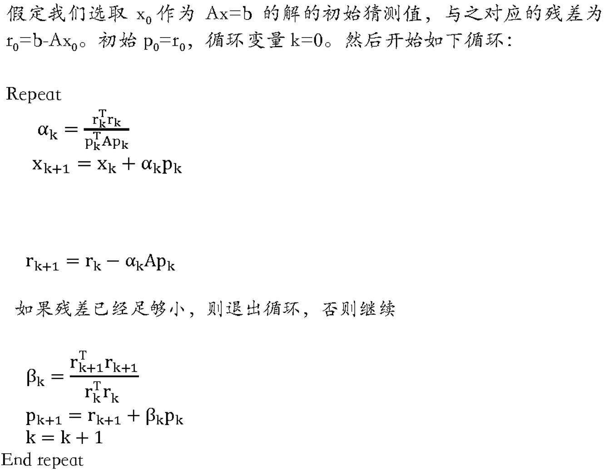

# 并行计算第四次作业实验报告

陈新	计研三一	2022210877

## 实验环境

使用本机环境进行实验，配置为：i9-9900KF (8 核 16 线程，基准频率 3.6 GHz), 16 GB$\times$2 (3200 MHz), Windows11

## 实验要求

实现一个“大规模稀疏矩阵的 `Conjugate Gradient` 求解器”，即，求解 $Ax=b$ 中的 $x$ ，其中 $A$ 为一个大型、稀疏矩阵。

要求：任选MPI或OpenMP实现这个算法。首先给出串行算法，并比较串行，1，2，4，8CPU（核）下运行的加速性和扩展性，加以分析。

## 实验结果

使用 `openmp` 完成实验

稀疏矩阵表示为：`(row, col, value)` 三元组的数组

1. 随机生成稀疏矩阵
   1. 使用拒绝采样方法，生成 `(row, col, value)` 三元组的数组作为非零元素的原始坐标
   2. 分别按优先 `dim 0` 坐标、优先 `dim 1` 坐标进行排序得到 `rdata/cdata` （此处为 $v \bullet M$ 冗余设计，但实际上并不需要 `cdata`）
2. 计算 $M \bullet v$ （只有 $Ap_k$ 计算）
   1. 

| 线程数                          | 1 （与串行速度相同） | 2     | 4     | 8     | 16    |
| ------------------------------- | -------------------- | ----- | ----- | ----- | ----- |
| Steps (/ second)                | 0.341                | 0.651 | 1.220 | 2.132 | 2.655 |
| Interactions (billion / second) | 0.307                | 0.586 | 1.098 | 1.919 | 2.389 |

附：部分运行结果截图

