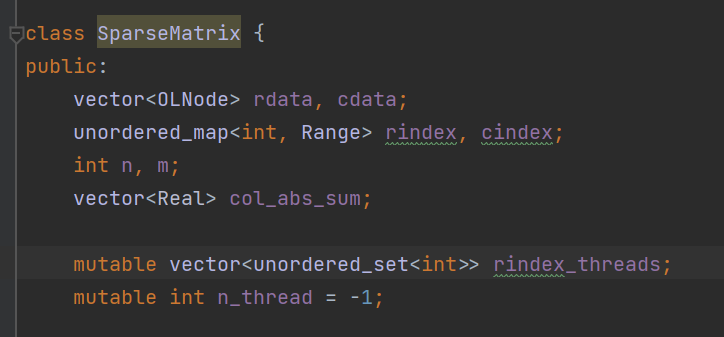

# 并行计算第四次作业实验报告

陈新	计研三一	2022210877

## 实验环境

使用本机环境进行实验，配置为：i9-9900KF (8 核 16 线程，基准频率 3.6 GHz), 16 GB$\times$2 (3200 MHz), Windows11

## 实验要求

实现一个“大规模稀疏矩阵的 `Conjugate Gradient` 求解器”，即，求解 $Ax=b$ 中的 $x$ ，其中 $A$ 为一个大型、稀疏矩阵。

要求：任选MPI或OpenMP实现这个算法。首先给出串行算法，并比较串行，1，2，4，8CPU（核）下运行的加速性和扩展性，加以分析。

## 实验结果

使用 `openmp` 完成实验

`CMAKE_FLAG`

1. `ENABLE_PARALLEL_FALG`，ON 为并行，OFF为串行

`args`:

1. `--n`，指定维度 n, $A_{n \times n} x_n = b_n$， 默认值为 1000000
2. `--n_non_zero`，指定稀疏矩阵内非零元素的个数，默认值为 20000000
3. `--threads`，指定 `openmp` 并行线程数，默认值为2

稀疏矩阵表示为：`(row, col, value)` 三元组的数组

1. 随机生成稀疏矩阵
   1. 使用拒绝采样方法，生成 `(row, col, value)` 三元组的数组作为非零元素的原始坐标
   2. 分别按优先 `dim 0` 坐标、优先 `dim 1` 坐标进行排序得到 `rdata/cdata` （此处 `cdata` 是为 $v \bullet M$ 的冗余设计，实际上在该 case 的情况下并不需要，可以删去）
2. 计算 $M @ v$ （只有 $Ap_k$ 计算）
   1. 将有非零数据的行平均分配给各线程计算
   2. 

3. 计算 $v @ v / v \times Real$ 
   1. 将 $[0, \frac{length}{n\_thread}), [\frac{length}{n\_thread}, 2*\frac{length}{n\_thread}) ...$ 分配给各线程计算（为了数据的空间局部性，更好地利用 cache）
   2. 

在 `n = 1000000, n_non_zero = 20000000` 条件下

| 线程数          | 串行   | 1      | 2       | 4       | 8       |
| --------------- | ------ | ------ | ------- | ------- | ------- |
| 耗时（秒/迭代） | 0.1582 | 0.2162 | 0.1448  | 0.1212  | 0.1145  |
| 加速比          | 100%   | 73.17% | 109.25% | 130.53% | 138.17% |
| 利用率          | -      | 100%   | 74.65%  | 44.60%  | 23.60%  |

## 实验分析

多线程相较于串行有较大的性能损失，线程数提升后利用率降低，都是因为使用 `openmp` 编程的 `parallel` 块仅限于单次运算符运算，这会使得

1. 每一步运算后显式同步了一次。实际上，`openmp` 要想做到惰性检查数据同步，可能必须放弃 `OOP` 对运算符的抽象。但我们可以用 `MPI` 的异步 IO 减少同步的耗时，通过在 `Vector` 类中添加 `request/ref_id` 等 tag，来做到高度 `OOP` 的同时实现惰性数据同步。
2. 每次运算符都会触发 `parallel` 块，线程的分配/分发与回收占了很多不必要的耗时，这一点通过对比串行/1线程的数据可以尤为明显地看出。后续可以通过将 `parallel` 块扩充至 iter 迭代外，并通过手动编写 `section/task` 等，减小控制粒度以减少开销

同时，稀疏矩阵下并行相较于串行无法完全发挥计算潜力，这也是加速比/利用率较低的一个原因；即使采用 `MPI` ，也会出现数据传递耗时与计算相当，以至于成为瓶颈的现象，因此随着线程数的增加，资源利用率还是会显著降低

但总的来说，可以看出 `openmp` 虽然是一个便于编写代码的选择，但是由于其控制粒度不够细，难以进行极致的性能利用，在高性能需求的场景下应该更多地使用 `MPI` 而非 `openmp`

## 附：部分运行结果截图

为方便测试，此处的矩阵采取文件读取的方式。如果随机生成，需要约 20s

